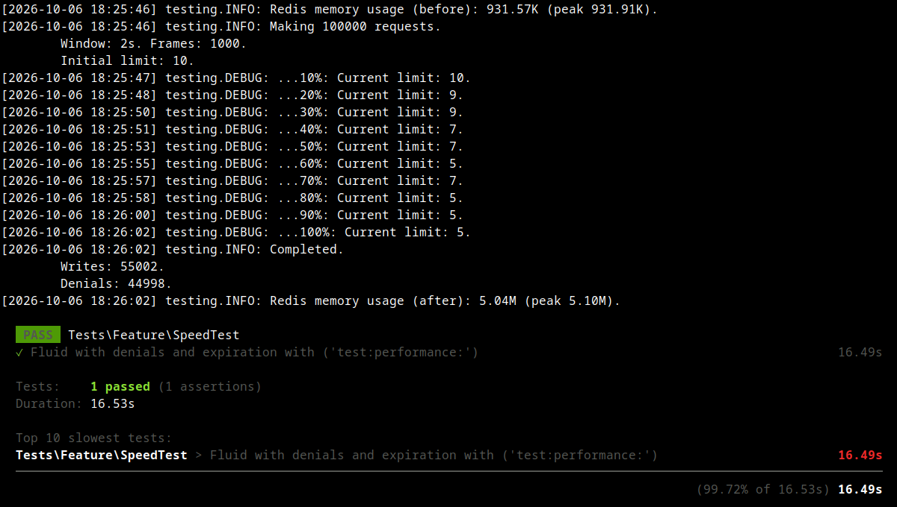
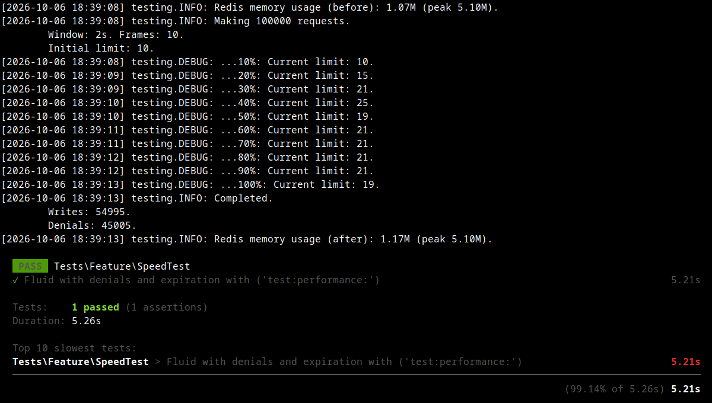

# Discrete window throttling library


A strict rate limiter with reasonable performance and memory usage.

Just like the **sliding log** algorithm, it **guarantees** "no more than X events per T time", but it doesn't store every single _event_.
Instead, it splits the time _window_ into N+1 counters (_frames_). This gives it predictable memory usage and performance.
The trade-off is an extra delay of up to one _frame_ when an event leaves the _window_.

Example:
1. We want to allow no more than 30 messages per 10 minutes.
2. We can create a window with 10 frames, 60 seconds each.
3. Internally, 11 frames will be created, and a message received right now will expire in [10\.\.11] minutes.

The added delay **shrinks** as the _frame count_ increases, but calculation complexity **grows**.

The library is written entirely in Lua as a set of **Redis functions** but wrapped in a Laravel package to simplify its usage.
For languages other than PHP, you only need the [throttling.lua](throttling.lua) file.

## Features
- ETA (retry after). Calculates it for every operation and any event count.
- Parallelism. Primary operations are implemented as single functions, so they can be called safely from different jobs or machines.
- Precision. The minimum possible _window_ duration is _frame count_ microseconds.
- Small memory usage. Each _gateway_ stores a binary string of `64 + 64 + frame_width * (frame_count + 1)` bits.

#### Performance / complexity
Worst-case complexity is `frame_count + 1` operations.
_Total_ _event count_ in the time _window_ is **cached** in the header, so when `event_count >= limit - total_count`, the check costs only a **single** operation plus **expired frame** clearing (the distance between the current time and the last check time in frames). Write operations and checks are usually fast, but when `eta > now`, using some client-side waiting mechanism is recommended.

## Usage
### Raw
```javascript
async function trySend(message) {
	const frame_count = 10, frame_length = 60 * 10**6, frame_width = 5, limit = 30, event_count = 1;
	const { ticket_id, user_id } = message;
	const [taken, eta] = await redis.fCall('dwthrottler_try',
			[`throttling:${ticket_id}:${user_id}`],
			[frame_count, frame_length, frame_width, limit, event_count]);
	if(parseInt(taken) > 0)
		message.send();
	else
		setTimeout(() => trySend(message), Math.ceil(parseInt(eta) / 1000 - Date.now()));
}
```

### PHP
```php
$throttling = app()->make(\Ontec\Throttling\DiscreteWindow::class, [
	'connection' => \Illuminate\Support\Facades\Redis::connection('cache')
	'frame_count' => 10,
	'frame_length' => \Carbon\CarbonInterval::minute(),
	'frame_width' => 5,
]);
$this->throttler->relative_eta = true;

// ...

$r = $throttling->tryLog("throttling:{$ticket_id}:{$user_id}", 1, 30);
if($r->taken > 0)
	$message->send();
else
	$job->delay($r->eta);
```

## Installation
### Raw
```sh
cat throttling.lua | redis-cli -x FUNCTION LOAD REPLACE
```
### Laravel
```sh
composer require ontec/discrete-window-throttling
php artisan vendor:publish --tag=redis-functions
```
```php
$code = file_get_contents(resource_path('redis/functions/discrete_window_throttling.lua'));
\Illuminate\Support\Facades\Redis::function('LOAD', 'REPLACE', $code);
```

## Reference
### Parameters
- `key`. Redis key where all data related to the _gateway_ is stored as a binary string.
- `frame_length`<sup>\[1\]</sup>. Duration of each _frame_ in **microseconds**.
- `frame_count`<sup>\[1\]</sup>. Number of _frames_ in the time _window_.
- `frame_width`<sup>\[1\]</sup>. Number of **bits** reserved for each _frame_ counter.
- `limit`. Maximum number of events allowed in the time _window_. It can vary freely between queries.
- `event_count`. Number of events to store/request/get ETA for, depending on the function.

<small>1. This parameter is related to **binary data geometry**. If you want to change it, you must **wipe the key** first. Otherwise, any kind of unpredictable errors are unavoidable.</small>

### Functions
- `FCALL dwthrottler_try 1 key frame_count frame_length frame_width limit event_count` => `{ taken_count, eta }`<sup>\[2\]</sup>  
	Logs `event_count` events, or returns ETA as a timestamp in microseconds if they don't fit.
- `FCALL dwthrottler_fill 1 key frame_count frame_length frame_width limit event_count` => `{ taken_count, eta }`<sup>\[2\]</sup>  
	Logs the largest fitting part of `event_count` and returns ETA for the rest.
- `FCALL dwthrottler_events 1 key frame_count frame_length frame_width event_count` => `{ total_count, expired_count }`  
	Only logs events; performs no limit checks and calculates no ETA. Returns the _total_ event count in the window and the number of expired events (when possible, because the key itself has a TTL). It can be called with `event_count = 0` to actualize _gateway_ data or query the _total_.
- `FCALL_RO dwthrottler_eta 1 key frame_count frame_length frame_width limit event_count` => `eta`<sup>\[1\]</sup>  
	Only calculates ETA. It may work slower than `dwthrottler_try` because it doesn't refresh data and therefore can't use the cached _total_.
- `FCALL_RO dwthrottler_now 0` => `timestamp`<sup>\[1\]</sup>  
	Returns the current timestamp from the Redis server in microseconds. Useful for synchronization and debugging.

<small>1. Non-modifying functions. They don't increase the AOF file size and can be used safely on replicas.</small>  
<small>2. Atomic functions. If _event_count_ modification takes place, only these functions should be used to sustain parallelism safety.</small>

## Benchmarks (AMD Ryzen 7 H 255)
100K requests across 1K keys, 1K frames: **6K RPS** 
100K requests across 1K keys, 10 frames: **19K RPS** 

## License
Apache 2.0. See [LICENSE](LICENSE).
